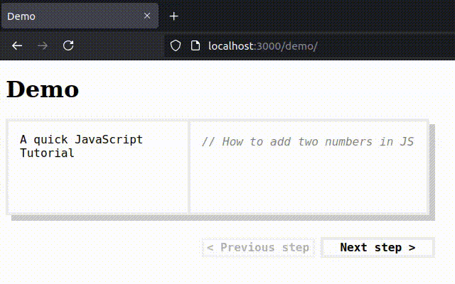

# `<code-movie-html>` - Use HTML as a DSL for [@codemovie/code-movie](https://code.movie) animations

Write this in HTML:

```html
<code-movie-html language="javascript">
  <figure>
    <pre>// How to add two numbers in JS</pre>
    <figcaption>A quick JavaScript Tutorial</figcaption>
  </figure>
  <figure>
    <pre>// How to add two numbers in JS
function add() {}</pre>
    <figcaption>Step 1: declare a function</figcaption>
  </figure>
  <figure>
    <pre>// How to add two numbers in JS
function add(a, b) {}</pre>
    <figcaption>Step 2: add function parameters</figcaption>
  </figure>
  <figure>
    <pre>// How to add two numbers in JS
function add(a, b) {
return a + b;
}</pre>
    <figcaption>
      Step 3: apply the plus operator and return the result
    </figcaption>
  </figure>
</code-movie-html>
```

Get an interactive code-movie-html tutorial like this:



## Getting started

First install this library and its peer dependency [@codemovie/code-movie](https://code.movie):

```shell
npm install @codemovie/code-movie-html @codemovie/code-movie
```

You can then import the module `@codemovie/code-movie-html` into your project. The
module automatically registers the custom element `<code-movie-html>` which is then
**almost** ready for use.

## Language loading

`@codemovie/code-movie` is quite heavyweight and is therefore neither bundled
into `<code-movie-html`> nor are its language modules loaded eagerly. Instead,
language modules are _by default dynamically imported on demand_, which
necessitates one of three things:

1. Some sort of **build process** that takes care of resolving dependency
   specifiers like `@codemovie/code-movie/languages/ecmascript` at compile time.
   Webpack, esbuild, Rollup and basically every other popular module bundler
   should be able to do this. Just make sure that you enable code splitting and
   tree shaking in your bundler - you don't want an entire Rust parser in your
   bundle unless you intend to use it.
2. A [**`<script type="importmap">`**](https://developer.mozilla.org/en-US/docs/Web/HTML/Element/script/type/importmap)
   to resolve dependency specifiers at runtime. Check out `demo/index.html` to
   see this in action.
3. A **replacement for the built-in module loader**. Everything concerned with
   loading language modules can be overwritten globally. Just change or replace
   the objects in the following properties on the global object:
     - `globalThis[Symbol.for("CodeMovieHTML.moduleCache")]`
     - `globalThis[Symbol.for("CodeMovieHTML.moduleLoaders")]`
     - `globalThis[Symbol.for("CodeMovieHTML.languageLoaders")]`

## HTML API

### Content model

The element expects its children to be `<figure>` elements containing `<pre>`
elements and optional `<figcaption>` elements. The text content from the `<pre>`
elements is used as input to the animation engine and the HTML content of
`<figcaption>` elements is displayed alongside the current frame. All other
children of either `<figure>` or `<code-movie-html>` itself are ignored.

### Custom controls

Just like with [@codemovie/code-movie-runtime](https://github.com/CodeMovie/code-movie-runtime),
you can build HTML for custom controls and assign it to the slot named
`controls`. Clicks on the element with the attribute `data-command="controls-prev"`
go to the previous keyframe, clicking on `data-command="controls-next"` goes to
the next keyframe.

### Content attribute `language`

Programming language to use for highlighting and animation heuristics. Can be
set to any of the following values:

- `"plaintext"`
- `"json"`
- `"elixir"`
- `"rust"`
- `"css"`
- `"html"`
- `"javascript"`
- `"typescript"`
- `"javascript-jsx"`
- `"typescript-jsx"`

The attribute defaults to `"plaintext"`. Setting the content attribute to an
invalid value has no effect.

## Styling

### Syntax highlighting

[See the styling reference for Code.Movie](https://code.movie/docs/styling/css.html).

### Shadow DOM parts

The element's shadow DOM is built up as follows:

```html
<div part="stage">
  <code-movie-runtime part="animation"></code-movie-runtime>
  <div part="controls">
    <slot name="controls">
      <div part="default-controls">
        <button part="default-controls-prev" data-command="controls-prev">
          <span>&lt; Previous step</span>
        </button>
        <button part="default-controls-next" data-command="controls-next">
          <span>Next step &gt;</span>
        </button>
      </div>
    </slot>
  </div>
  <div part="captions"></div>
</div>
```

You can use [`::part()` pseudo elements](https://developer.mozilla.org/en-US/docs/Web/CSS/::part) to style the elements with `part` attributes. See `demo/index.html` for inspiration.

The default controls are just fallback content for a shadow DOM slot. This means they are very easy to replace by simply assigning something to the slot `controls`. Your custom navigation buttons need the attributes `data-command="controls-prev"` and `data-command="controls-next"` respectively to work.

### Loading state

The [Custom State](https://developer.mozilla.org/en-US/docs/Web/API/CustomStateSet)
**`loading`** is active while the element loads a new language module. You can
use the following CSS selector to customize the element's style in this phase:

```css
code-movie-html:state(loading) {
  filter: blur(0.1em); /* default style for this state */
}
```

## JavaScript API

### `<code-movie-html>` instances

#### Getter/Setter `language: string`

Reflects the content attribute `language`. Using the setter with an invalid
value results in a runtime exception.

#### Method `next() => void`

Goes to the next frame. Does nothing if already at the last frame;

#### Method `prev() => void`

Goes to the previous frame. Does nothing if already at the first frame;

#### Method `goTo(index: number) => void`

Goes to the frame at the specified index. Coerces and rounds indices to integers and clamps them to the range of available keyframes.

## Low-level modules

You can import two low-level objects from `@codemovie/code-movie-html/lib`: the
unregistered element class and the core function `framesFromDom()`.

## Class `CodeMovieHTML`

Import this instead of the main import get register the class with a custom tag
name or to extend it.

## Function `framesFromDom(containerElements: Element[], sourceSelector = "") => InputFrame[]`

Takes an array of elements and turns it into an array of input frames compatible with the function `fromStringsToScene()` from `@codemovie/code-movie`. If a non-falsy value is provided for `sourceSelector`, the function will take its content from the first matching descendant of each container element; otherwise the container elements themselves serve as sources.
